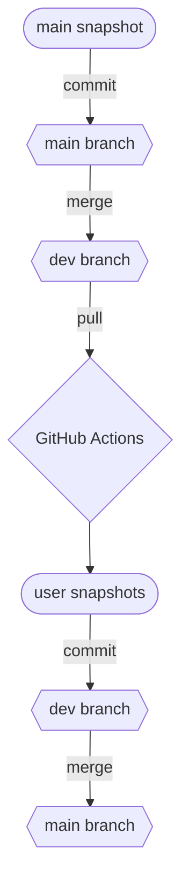

# P.FOH-WING
## Parousia WING source control

Deze repository beheert de versies van verschillende configuraties op de Behringer Wing van Parousia Zoetermeer.

Wijzigingen van de "main snapshot" worden met een Python script automatisch doorgevoerd op de "user snapshots".

### Stappen om nieuwe snapshot te verwerken:

#### Snapshot aangepast op WING:

- Sla de snapshot op met de juiste lagen actief
- Mount de WING
- In `WING_DATA`, format de snapshot
- Maak een commit van de `WING_DATA` repo met de changes in de commit message
- Push de commit naar `main`
- Op de P.FOH WING repo, pull de `main` branch
- `git checkout dev`, `git merge main —no-ff`
- Push naar `dev`
- Automation gaat draaien, hierna pullen naar `dev`
- `git checkout main`, `git merge dev —no-ff`
- Push naar `main`
- Op de `WING_DATA` repo, pull van `main`

#### Snapshot aangepast in editor:
- Maak een commit op de `dev` branch met de changes in de commit message
- Push naar `dev`
- Automation gaat draaien, hierna pullen naar dev
- `git checkout main`, `git merge dev —no-ff`
- Push naar `main`
- Op de `WING_DATA` repo, pull van `main`
